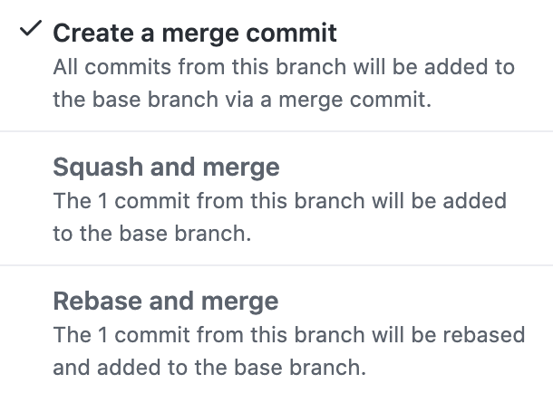
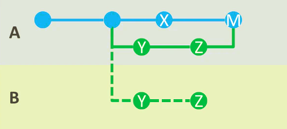
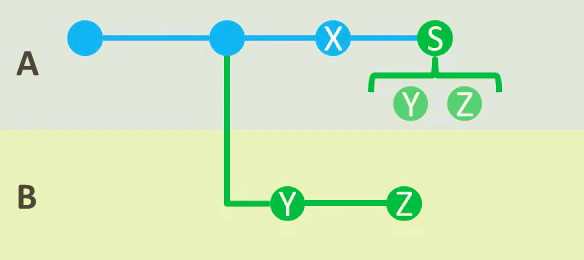

## Githubのより詳細な使い方
### Branchに関して
`git-flow`というワークフローがあります。`master`ブランチ, `develop`ブランチ, `feature`ブランチ, `release`ブランチ, `hotfix`ブランチを作って開発するという考え方です。主に自分の場合は、`master`ブランチ, `develop`ブランチ, `feature`ブランチだけを使って開発しています。それぞれの役割は次の通りです。

* master ブランチ<br/>
    本番用のブランチ。確実に動作するようなコードが入っています。バージョン毎に`develop`ブランチをmergeします。。

* develop ブランチ<br/>
    開発用のブランチ。開発するときはこのブランチをリポジトリの設定で`default`ブランチに指定します。`develop`ブランチには、`feature`ブランチをmergeしていきます。

* feature ブランチ<br/>
    作業用のブランチ。機能毎に`develop`ブランチから`feature`ブランチを切ります。複数人で作業している場合このブランチ以外では、作業をしないようにしましょう。なるべく細かくコミットをしていきます。例えば、トップページを作りたい場合、features/top_page のようにブランチに名前をつけてそのブランチで開発します。機能が完成したら、`develop`ブランチに`Pull request`を送り、コンフリクトを解消した後に`features/xxx`ブランチを`develop`ブランチにmergeします。

#### 参考資料
* [図解】git-flow、GitHub Flowを開発現場で使い始めるためにこれだけは覚えておこう](https://www.atmarkit.co.jp/ait/articles/1708/01/news015.html)

* [git-flow cheatsheet](http://danielkummer.github.io/git-flow-cheatsheet/index.ja_JP.html)


### mergeに関して
   pull requestにあるmergeボタンのドロップダウンを見ると、mergeには3種類あります。
    <div align="center">
    
    </div>
* Create a merge commit<br/>
　merge先に、mergeコミットとmerge元にした変更履歴を加えます。 `develop`ブランチから`master`ブランチにmergeする時に使います。
    <div align="center">
    
    </div>
* Squash and merge<br/>
　全ての変更履歴を1つにまとめたコミットをmerge先にします。`feature`ブランチから`develop`ブランチにmergeする時に使います。変更履歴をまとめることで、`develop`ブランチのログがきれいになります。
    <div align="center">
    
    </div>
* Rebase and merge<br/>
　使ったことがありません笑

## 開発方法
1. リポジトリを作成したら、`develop`ブランチを作成しましょう。そして、リポジトリの設定から`develop`ブランチを`default`ブランチに設定します。
2. 開発する機能が決まったら、`develop`ブランチから`features/[機能名]`ブランチを切ってそこで開発しましょう。自由にコミットして大丈夫です。
3. 機能の開発が終了したら、features/[機能名]ブランチを`develop`ブランチにmergeするために、`Pull request`を作成しましょう。
    1. リポジトリのwebページから、`Pull requests`タブを選択して`New pull request`ボタンを押しましょう。
    2. merge先のブランチを`develop`ブランチに、merge元のブランチを`features/[機能名]`ブランチに変更しましょう。
    3. プルリクエストの表題と、何を開発したのかを記述してmergeします。コンフリクトが発生しなかった場合は4に飛んでください。
    4. コンフリクトが発生した場合には、修正コミットをpushします。
    5. 次のような場所がコンフリクトが発生している箇所です。

    ```
        <<<<<<< HEAD
        # develop(マージ先ブランチ)での変更内容
        ・・・
        =======
        # feature(マージ元ブランチ)での変更内容
        ・・・
        >>>>>>> develop
    ```

    6. `<<<`, `===`, `>>>`,も削除してその箇所をどう変更するか決めましょう。
4. `squash and merge`を選択してmergeしましょう。こうすることで、`feature`ブランチでの変更履歴を一つにまとめることができ、ログが綺麗になります。
5. という形で、各々が`feature`ブランチを切って`develop`ブランチにmergeしていくことでチームでの開発が可能になります！
