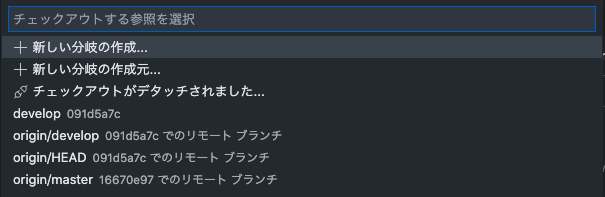
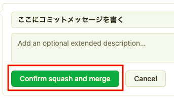

## 初めに
このページでは、VSCode上でのgitの使い方を解説します。

### 拡張機能のインストール

次の拡張機能をインストールしてください。
* Git Graph 
VSCode上でGitログが見れるようになります。

    

* Git Lens 
commitメッセージがコード上に表示されるようになります。

    

* gitignore 
言語に応じたgitignoreを自動的に作成してくれます。

    

## 基本的な操作方法
Gitの操作は上から3番目のアイコンをクリックして表示されるウィンドウで操作する.

    

### Git Add & Commit
赤枠の更新ボタンを押す。

    

変更したファイルがあると、このように変更タブの下に表示される。
test.pyの変更を、Git addしたい時は赤枠のプラスボタンを押す。

    

すると、ステージングされている変更に追加される。 
この変更をcommitしたい時には、[メッセージをここに入力する]にコミットメッセージを書く。 
最後に赤枠のチェックマークを押すとコミット完了。

    

### Git reset: コミットの取り消し
左下にある、COMMITSを押すと次のように表示される。

    

先ほど追加した、コミットを選択し、赤枠の戻るマークをクリックすると、コミットを取り消すことができる。

    

### Git Push: リモートに変更をアップロード
左下にある、COMMITSを押すと次のように表示され、Change to push to origin on Githubを選択する。 
赤枠の、アップロードボタンを押す。

    

すると、次のポップアップが表示され、Pushをクリック。

    

### Git Pull: リモートの変更をローカルに適用
画面左下にある、赤枠のボタンをクリックする。

    

すると、次のような警告ポップアップが表示され、OKボタンを押すと、リモートの変更をローカルに適用させることができる。

    

### Git branch: ブランチを作成
今いるブランチは赤枠のところに表示されている。

    

赤枠をクリックすると、次のポップアップが表示される。

    

新しい分岐の作成を選択する。作成する分岐の名前を入力してエンター。

    

ブランチを作成でき、赤枠を確認すると、新しく作成したブランチに移動していることがわかる。

    

### Git merge: ブランチをmergeする
Macなら Command + Shift + P, Windowsなら Ctrl + Shift + Pを押し、「merge」と検索する。そして、「Git: ブランチをマージ」を選択。

    

現在いるブランチにmergeしたいブランチを選択してクリックすると、mergeされる。

    

### Git pull request
リポジトリのWebを開く
赤枠のPull requestを選択する。

    

New pull requestボタンを押す。

    

baseにmerge先(develop), compareにmergeするブランチ(features/xx)を選択する.

    

Create pull requestボタンを押す。

    

Pull requestのタイトルと、変更内容を記述し、右下のCreate pull requestを押す。

    

Merge pull requestボタンの右側にある、プルダウンをクリックし、Squash and mergeを選択する。

    

Squash and mergeになっていることを確認したら、Squash and mergeボタンを押す。

    

コミットメッセージを押したら、Confirm squash and mergeボタンを押して、mergeする。

    

最後に、mergeしたブランチをDelete branchボタンを押して削除すれば、完了。

    

## その他(また今度)

### コンフリクト解消方法
### 指定した範囲だけGit add
### Git stash: 変更を一時退避
### Git rebase -i: コミットをまとめる
